# **FUTWORLD**

Football Database

## Nombre de la Aplicación Web: FUTWORLD.

## Descripción Temática de la Web:

La aplicación web, consiste en una base de datos donde se pueden hacer diferentes consultas de fútbol. A su vez, se puede inscribir nuevos equipos y jugadores en una determinada liga, si eres el mánager de un équipo. Para ello, hemos dividido la aplicación web en dos partes diferenciadas:

* Parte Pública: únicamente se pueden realizar consultas a la base de datos. Para realizar dichas consultas, se pueden filtrar los resultados por:

	+ Nombre del Jugador: se mostrarán las características de un único jugador.
	+ Equipo: se mostrará toda la plantilla de jugadores pertenecientes a ese equipo, ordenados por su valor de mercado.
	+ Edad: se mostrarán todos los jugadores con esa edad, ordenados por su valor de mercado.
	+ Nacionalidad: se mostrarán todos los jugadores con esa nacionalidad, ordenados por su valor de mercado.
	+ Liga: se mostrarán todos los equipos participantes en una determinada liga, ordenados alfabéticamente.
	+ Palmarés: se mostrarán todos los equipos de una determinada liga, ordenados por el número de torneos ganados de cada uno (mayor a menor).

* Parte Privada: cada usuario podrá inscribir y administrar a un equipo, gestionando su plantilla y jugadores. Cuando se inscriba un jugador, se deberá indicar su nombre, equipo, edad, nacionalidad y valor de mercado. Importante: un usuario no puede gestionar un equipo que no es el suyo por lo que, para evitar que esto ocurra, se gestionará dicha funcionalidad mediante un usuario y contraseña para cada usuario. 

## Entidades Principales:

1. Jugador: características de un jugador (nombre, equipo al que pertenece, edad, nacionalidad y valor de mercado).
2. Equipo: nombre de un equipo y plantilla de la que dispone para disputar el Torneo.
3. Mánager: director de un equipo, el cual es el encargado de inscribir a su equipo en una determinada liga y de gestionar su plantilla.
4. Torneo: campeonato de liga en el cúal se van a inscribir los equipos.
5. Palmarés: ranking de campeones del torneo.

## Servicio Interno:

El servicio interno de nuestra aplicación, va a ser utilizado para generar las fichas de los jugadores cada vez que se registre un jugador. El Cliente (FutWorld), le solicitará al servicio interno que, a partir de los datos del formulario de registro del jugador, el servicio interno le genere una ficha con los datos del jugador y se lo enviará al cliente. FutWorld será quien se encargue de almacenarlo en la carpeta correspondiente a su equipo, dentro de la carpeta "fichas" de la aplicación. Ambas aplicaciones se comunicarán mediante sockets.

## Integrantes del Proyecto: 

1. Jorge Palomo Neila. Correo: j.palomon@alumnos.urjc.es
2. Francisco Miján Sánchez. Correo: f.mijans@alumnos.urjc.es

# ** FASE 4 **

## Diagrama de Navegación:

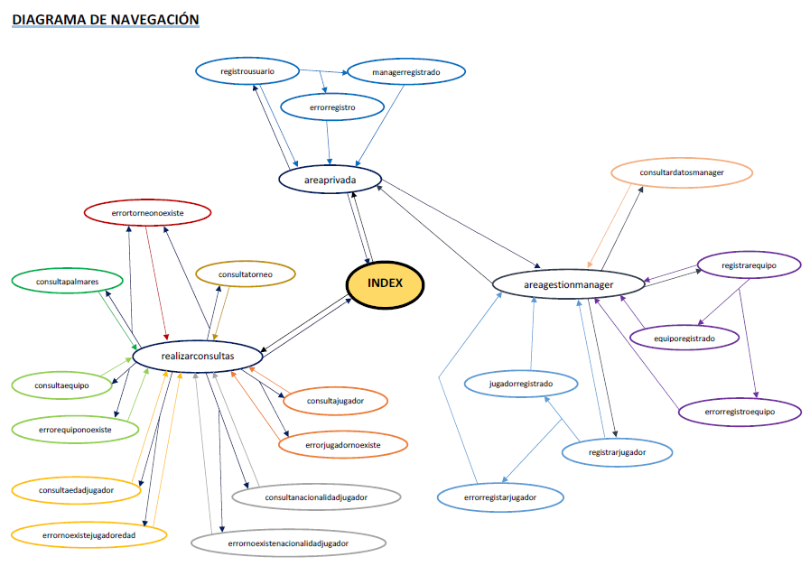

## Modelo Entidad/Relación:

## Diagrama UML:

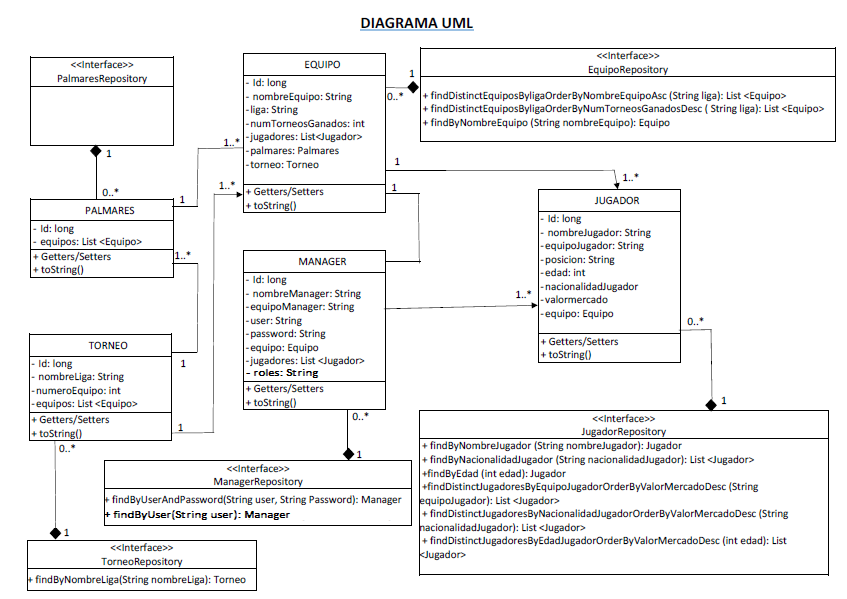

## Diagrama de Clases:

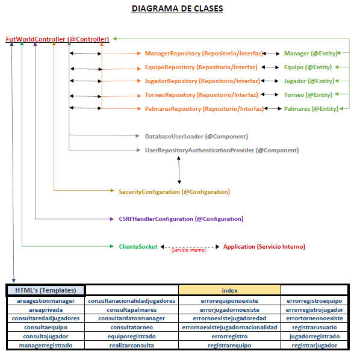

## Esquema de Azure:

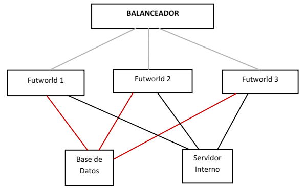

## Pantallazos de la aplicación:

A continuación, vamos a mostrar cada una de las pantallas de nuestra aplicación, así como las funcionalidades de las mismas.

Lo primero de todo, indicar que nos hemos generado una "keystore" en nuestra aplicación distribuida, dado que en esta fase hemos implementado seguridad y vamos a utilizar conexiones "https" para acceder a nuestra aplicación.

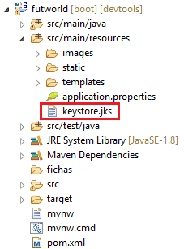

**Nota:** Hemos implementado el método "initDataBase" que es un @PostConstruct, donde hemos incluido algunos Mánagers, Torneos, Equipos y Jugadores para que nos aparezcan por defecto la primera vez que arrancamos la aplicación. Para posteriores ejecuciones, como ya se ha generado el esquema y se han cargado esos datos (persistencia), se han de comentar los elementos incluidos en el método "initDataBase", evitando así que se vuelvan a generar los datos (duplicándose). Esto abrá que hacerlo si queremos trabajar con las aplicaciones en local, pero cuando vayamos a subir la aplicación a azure, se ha de comentar directamente para que parta desde cero la base de datos y no haya datos dentro.

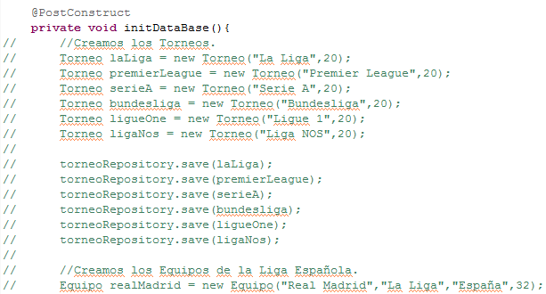

### Index:

Primeramente, mostramos la página principal de la aplicación:

Como podemos apreciar en la imagen, se divide en dos partes:

* Parte pública: Realizar consultas (nombre de jugador, plantilla, edad, nacionalidad, palmarés y torneo).

 

* Parte privada: Área de Gestión del Mánager (registros de Mánager, equipo y jugador y acceso a información del usuario).

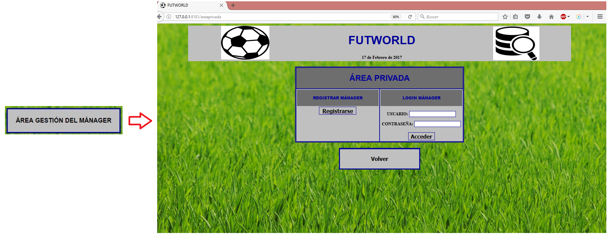

Como vemos en la imagen, para que un mánager pueda gestionar su equipo, primeramente ha de registrarse para obtener sus credenciales identificativos. 

### Registrar Mánager:

Podemos ver el formulario de registro del mánager y el mensaje de que se ha registrado correctamente.

Por otro lado, hemos generado el siguiente mensaje de error en caso de que exista un mánager registrado previamente con ese "user" y "password".

Una vez que el mánager se ha registrado, procederá a loguearse para acceder a su sesión:

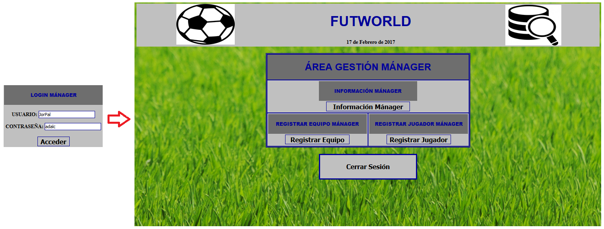

Por otro lado, en caso de que los datos introducidos sean incorrectos, se nos volverá a mostrar de nuevo el formulario de login (que se encuentra dentro del área privada).

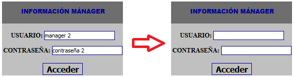

Una vez que el usuario ha accedido a su sesión podrá tanto consultar su información personal, así como registrar a un nuevo equipo o jugador. Para ello, primeramente mostramos el área de sesión del mánager:

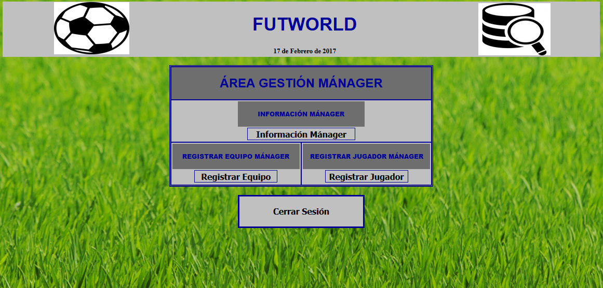

### Información Mánager:

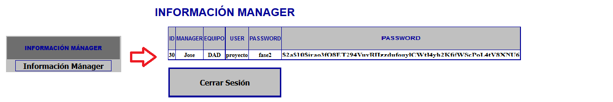

Vemos como se muestra correctamente, la información del usuario logueado.

**Nota**: La contraseña, ha diferencia de la fase de entrega anterior, ahora nos aparecera encriptada ya que le hemos añadido seguridad.

### Registrar Equipo:

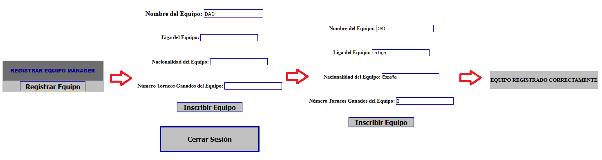

Mostramos el formulario de registro del equipo y el mensaje generado al registrarse correctamente.

**Nota:** Hemos dado valor directamente al nombre equipo mediante value, de esta forma le va a aparecer el nombre del equipo que puso el mánager al registrarse (evitando así equivocaciones al escribise).

Por otro lado, en caso de que haya un equipo registrado previamente con ese nombre, mostramos el siquiente mensaje de error.

### Registrar Jugador:

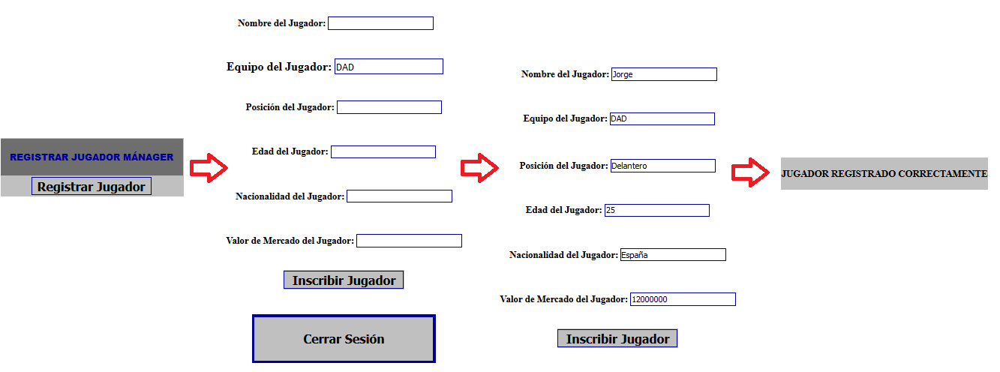

Mostramos el formulario de registro del jugador y el mensaje generado al registrarse correctamente.

**Nota:** Hemos dado valor directamente al nombre equipo mediante value, de esta forma le va a aparecer el nombre del equipo que puso el mánager al registrarse (evitando así equivocaciones al escribise).

Por otro lado, en caso de que haya un jugador registrado previamente con ese nombre, mostramos el siquiente mensaje de error.

### Servicio Interno:

Justo en este punto, es donde se hace uso del servicio interno de nuestra aplicación. Al darle al botón de registrar jugador, FutWorld le solicitará al servicio interno que le genere la ficha del jugador que se acaba de registrar. Para ello, le enviará los datos de registro del usuario para que pueda completarla y, una vez el servicio interno la haya creado, se la devuelve a nuestra aplicación para que le almacene en la carpeta del equipo correspondiente. En la siguiente foto, vemos un ejemplo de la ubicación donde se crea una ficha de un jugador, y el contenido de la misma:

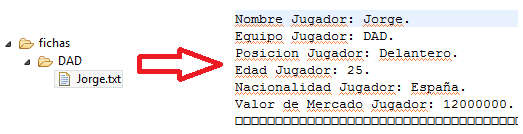

A continuación, mostraremos las funcionalidades de la parte pública de la aplicación.

### Consulta Jugador:

Vemos los datos del jugador introducidos.

En caso de no existir el jugador introducido, muestra el siguiente mensaje de error.

### Plantilla Equipo:

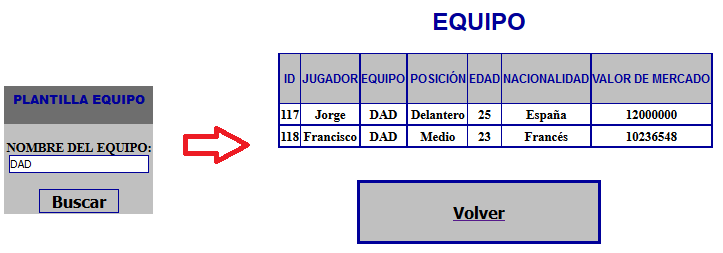

Vemos la plantilla de jugadores del equipo introducido.

En caso de no existir el equipo introducido, muestra el siguiente mensaje de error.

### Jugadores Edad:

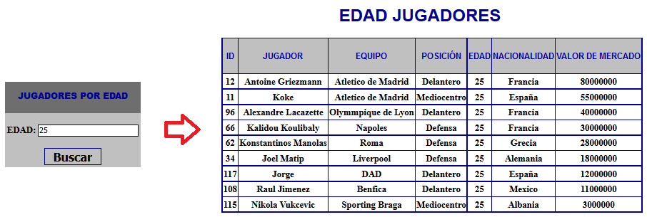

Mostramos el resultado de buscar jugadores con esas edad. Hemos implementado un error, en caso de que no haya jugadores con esa edad.

### Jugadores Nacionalidad:

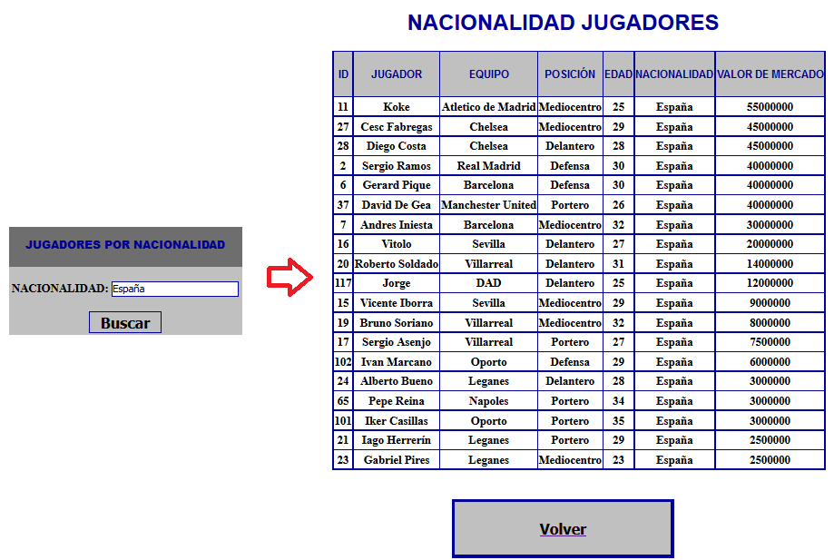

Mostramos el resultado de buscar jugadores con esas nacionalidad. Hemos implementado un error, en caso de que no haya jugadores con esa nacionalidad.

### Palmarés:

Mostramos el palmarés de un determinado torneo.

Por otro lado, en caso de no existir el torneo introducido, muestra el siguiente mensaje de error.

### Torneo:

Mostramos los equipos de un determinado torneo.

Por otro lado, en caso de no existir el torneo introducido, muestra el siguiente mensaje de error.

### Manual de Azure:

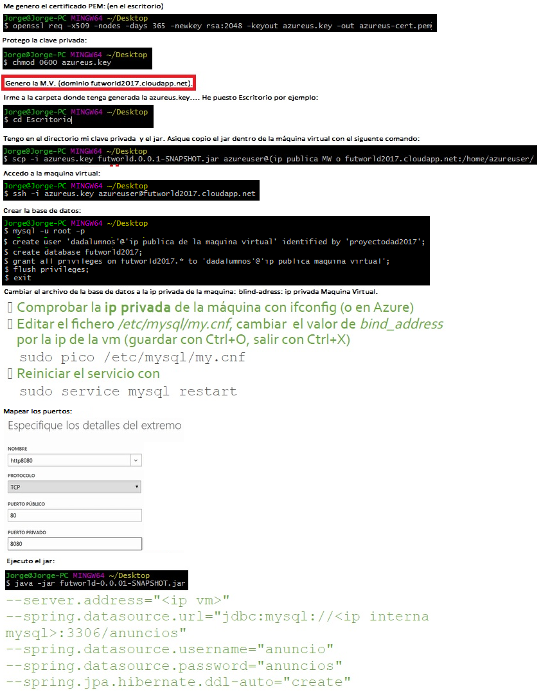

**Nota:** Si apagas y vuelves a encender la máquina virtual, cambian las IP's pública y privada de la máquina. Por tanto, habría que cambiar lo necesario en la BBDD y al ejecutar el jar, si queremos volver a arrancar la aplicación en Azure.
