# **FUTWORLD**

Football Database

## Nombre de la Aplicación Web: FUTWORLD.

## Descripción Temática de la Web:

La aplicación web, consiste en una base de datos donde se pueden hacer diferentes consultas de fútbol. A su vez, se puede inscribir nuevos equipos y jugadores en una determinada liga, si eres el mánager de un équipo. Para ello, hemos dividido la aplicación web en dos partes diferenciadas:

* Parte Pública: únicamente se pueden realizar consultas a la base de datos. Para realizar dichas consultas, se pueden filtrar los resultados por:

	+ Nombre del Jugador: se mostrarán las características de un único jugador.
	+ Equipo: se mostrará toda la plantilla de jugadores pertenecientes a ese equipo, ordenados por su valor de mercado.
	+ Edad: se mostrarán todos los jugadores con esa edad, ordenados por su valor de mercado.
	+ Nacionalidad: se mostrarán todos los jugadores con esa nacionalidad, ordenados por su valor de mercado.
	+ Liga: se mostrarán todos los equipos participantes en una determinada liga, ordenados alfabéticamente.
	+ Palmarés: se mostrarán todos los equipos de una determinada liga, ordenados por el número de torneos ganados de cada uno (mayor a menor).

* Parte Privada: cada usuario podrá inscribir y administrar a un equipo, gestionando su plantilla y jugadores. Cuando se inscriba un jugador, se deberá indicar su nombre, equipo, edad, nacionalidad y valor de mercado. Importante: un usuario no puede gestionar un equipo que no es el suyo por lo que, para evitar que esto ocurra, se gestionará dicha funcionalidad mediante un usuario y contraseña para cada usuario. Añadimos un servicio de uso exclusivamente interno, el cual permite al manager subir imagenes de los jugadores de su plantilla al editarlos.

## Entidades Principales:

1. Jugador: características de un jugador (nombre, equipo al que pertenece, edad, nacionalidad y valor de mercado).
2. Equipo: nombre de un equipo y plantilla de la que dispone para disputar el Torneo.
3. Mánager: director de un equipo, el cual es el encargado de inscribir a su equipo en una determinada liga y de gestionar su plantilla.
4. Torneo: campeonato de liga en el cúal se van a inscribir los equipos.
5. Palmarés: ranking de campeones del torneo.

## Integrantes del Proyecto:

1. Jorge Palomo Neila. Correo: j.palomon@alumnos.urjc.es
2. Francisco Miján Sánchez. Correo: f.mijans@alumnos.urjc.es

# ** FASE 2 **

## Diagrama de Navegación:

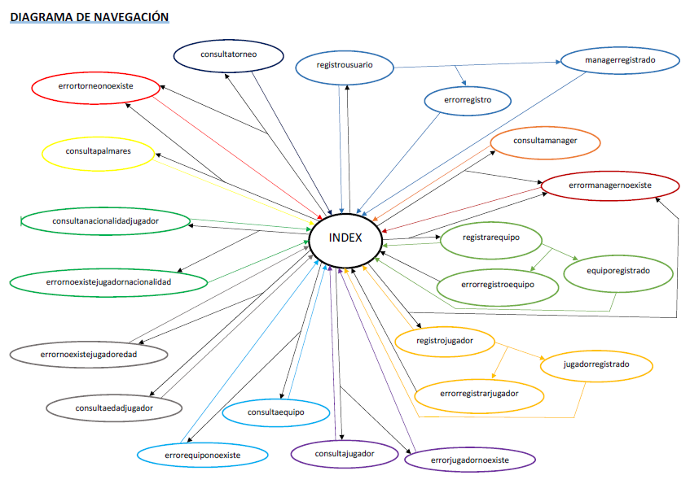

## Modelo Entidad/Relación:

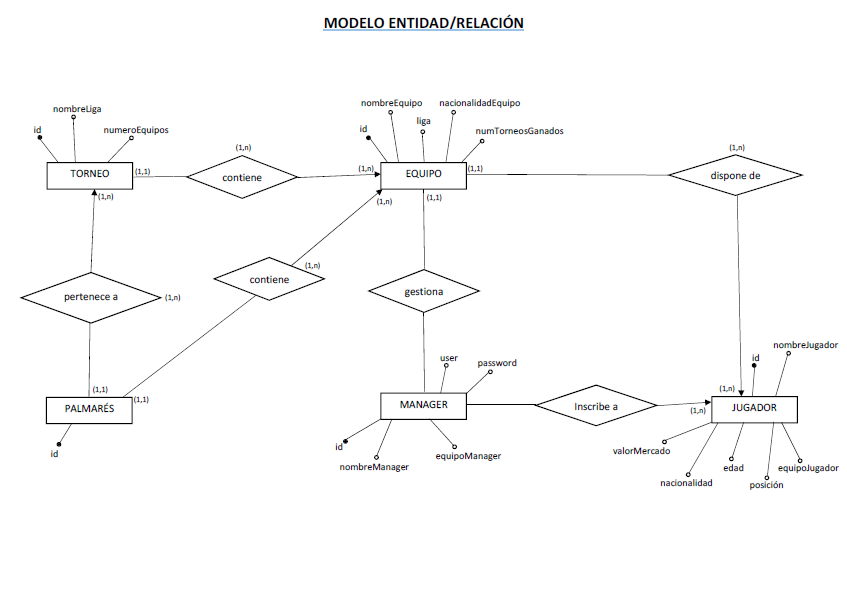

## Diagrama UML:

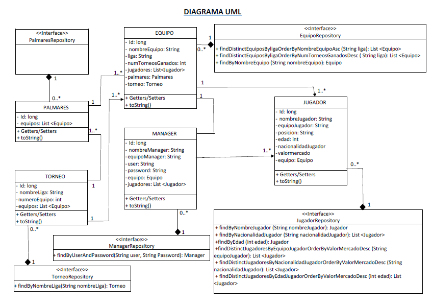

## Pantallazos de la aplicación:

A continuación, vamos a mostrar cada una de las pantallas de nuestra aplicación, así como las funcionalidades de las mismas.

**Nota:** Hemos implementado el método @PostConstruct, donde hemos incluido algunos Mánagers, Torneos, Equipos y Jugadores para que nos aparezcan por defecto la primera vez que arrancamos la aplicación. Para posteriores ejecuciones, como ya se ha generado el esquema y se han cargado esos datos (persistencia), se han de comentar los elementos incluidos en el método @PostConstruct, evitando así que se vuelvan a generar los datos (duplicándose).

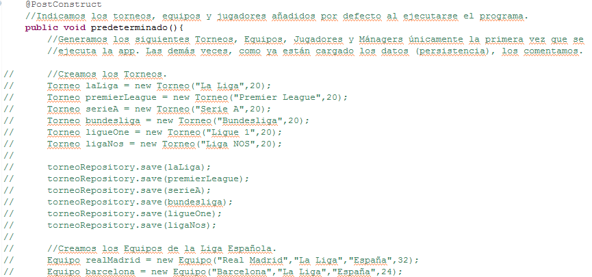

### Index:

Primeramente, mostramos la página principal de la aplicación:

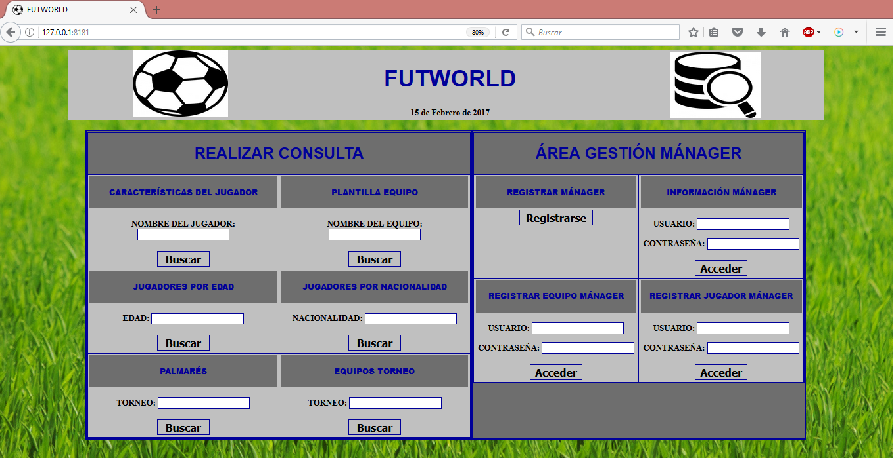

Como podemos apreciar en la imagen, se divide en dos partes:

* Parte pública: Realizar consultas (nombre de jugador, plantilla, edad, nacionalidad, palmarés y torneo).
* Parte privada: Área de Gestión del Mánager (registros de Mánager, equipo y jugador y acceso a información del usuario).

### Registrar Mánager:

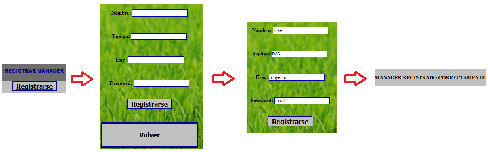

Podemos ver el formulario de registro del mánager y el mensaje de que se ha registrado correctamente.

Por otro lado, hemos generado el siguiente mensaje de error en caso de que exista un mánager registrado previamente con ese "user" y "password".

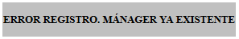

### Información Mánager:

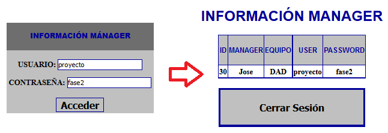

Vemos como se muestra correctamente, la información del usuario logueado.

Por otro lado, hemos generado el siguiente mensaje de error en caso de que los datos del manager introducidos (user y password), sean incorrectos.

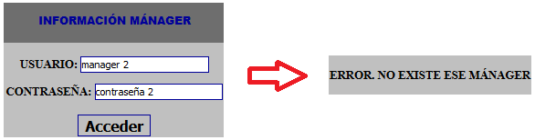

### Registrar Equipo:

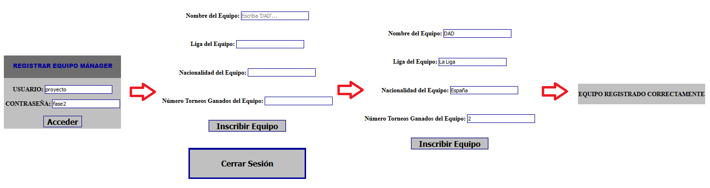

Mostramos el formulario de registro del equipo y el mensaje generado al registrarse correctamente.

**Nota:** Hemos creado un placeholder en nombre equipo, donde va a aparecer el nombre del equipo que puso el mánager al registrarse (evitando así equivocaciones al escribise).

Por otro lado, hemos generado el siguiente mensaje de error en caso de que los datos del manager introducidos (user y password), sean incorrectos.

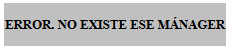

Por último, en caso de que haya un equipo registrado previamente con ese nombre, mostramos el siquiente mensaje de error.

### Registrar Jugador:

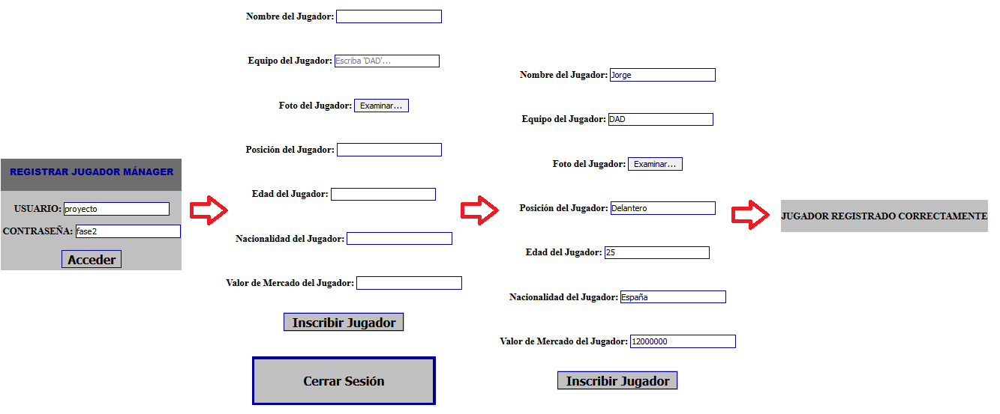

Mostramos el formulario de registro del jugador y el mensaje generado al registrarse correctamente.

**Nota:** Hemos creado un placeholder en nombre equipo, donde va a aparecer el nombre del equipo que puso el mánager al registrarse (evitando así equivocaciones al escribise).

Por otro lado, hemos generado el siguiente mensaje de error en caso de que los datos del manager introducidos (user y password), sean incorrectos.

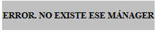

Por último, en caso de que haya un jugador registrado previamente con ese nombre, mostramos el siquiente mensaje de error.

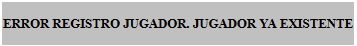

### Consulta Jugador:

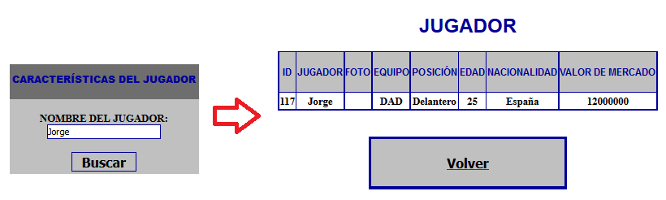

Vemos los datos del jugador introducidos.

En caso de no existir el jugador introducido, muestra el siguiente mensaje de error.

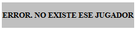

### Plantilla Equipo:

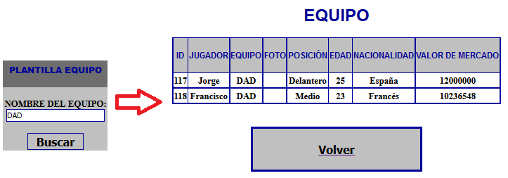

Vemos la plantilla de jugadores del equipo introducido.

En caso de no existir el equipo introducido, muestra el siguiente mensaje de error.

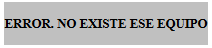

### Jugadores Edad:

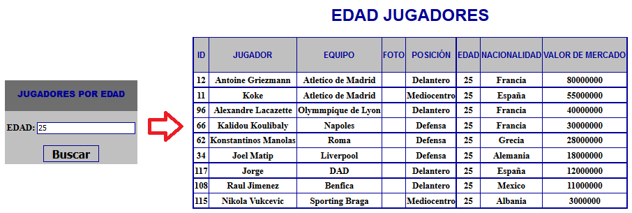

Mostramos el resultado de buscar jugadores con esas edad. Hemos implementado un error, en caso de que no haya jugadores con esa edad.

**Problema:** No hemos conseguido que nos lo muestre dicho mensaje de error como podemos ver en la siguiente imagen.

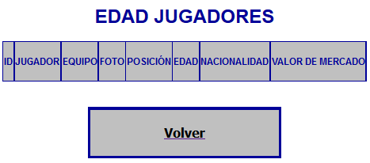

Nos aparece la tabla vacía dado que no hay ninguno, pero debería aparecer el mensaje de error anterior.

El código que hemos utilizado para ello es el siquiente:

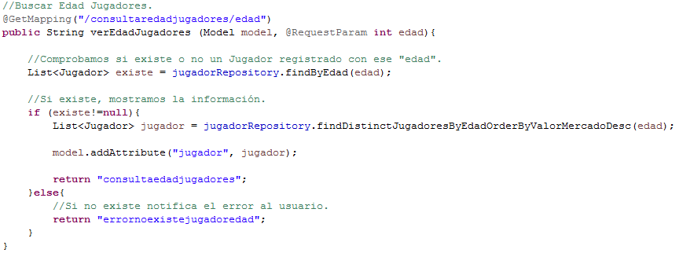

Creamos una lista vacía y hacemos una consulta al repositorio del Jugador, mediante la edad del jugador. En la lista almacenamos los jugadores que tengan esa edad, y en caso de que esté vacía debería mostrar el error, pero no hemos conseguido solucionarlo.

### Jugadores Nacionalidad:

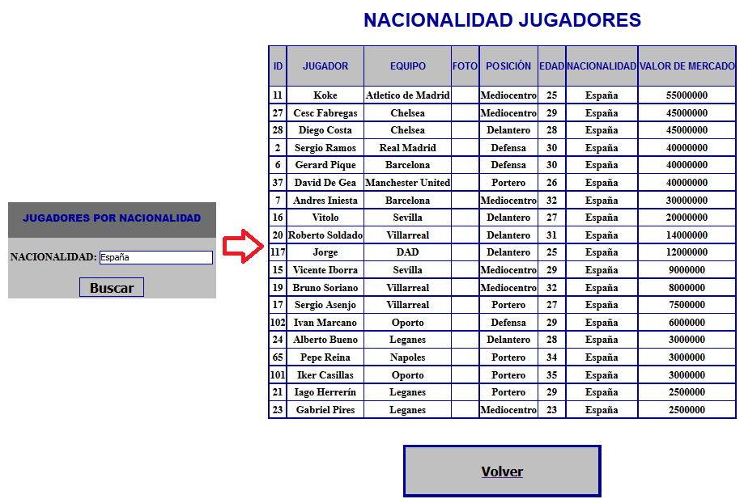

Mostramos el resultado de buscar jugadores con esas nacionalidad. Hemos implementado un error, en caso de que no haya jugadores con esa nacionalidad.

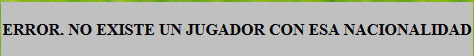

**Problema:** No hemos conseguido que nos lo muestre dicho mensaje de error como podemos ver en la siguiente imagen.

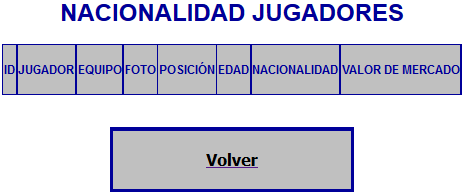

Nos aparece la tabla vacía dado que no hay ninguno, pero debería aparecer el mensaje de error anterior.

El código que hemos utilizado para ellos es el siquiente:

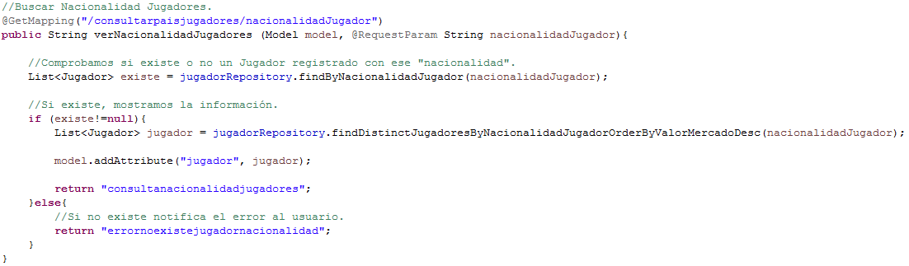

Creamos una lista vacía y hacemos una consulta al repositorio del Jugador, mediante la nacionalidad del jugador. En la lista almacenamos los jugadores que tengan esa nacionalidad, y en caso de que esté vacía debería mostrar el error, pero no hemos conseguido solucionarlo.

### Palmarés:

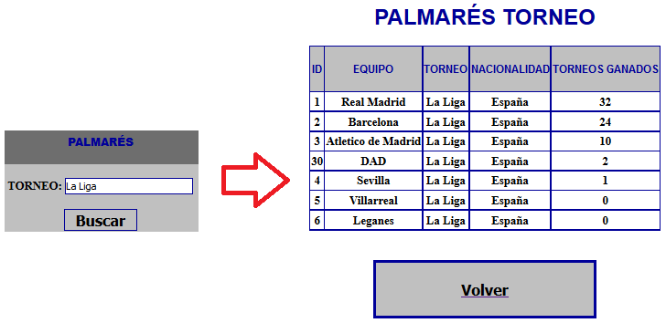

Mostramos el palmarés de un determinado torneo.

Por otro lado, en caso de no existir el torneo introducido, muestra el siguiente mensaje de error.

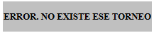

### Torneo:

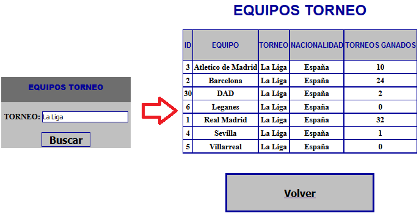

Mostramos los equipos de un determinado torneo.

Por otro lado, en caso de no existir el torneo introducido, muestra el siguiente mensaje de error.

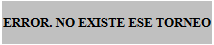
